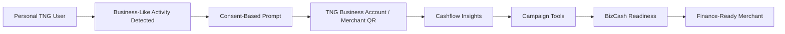
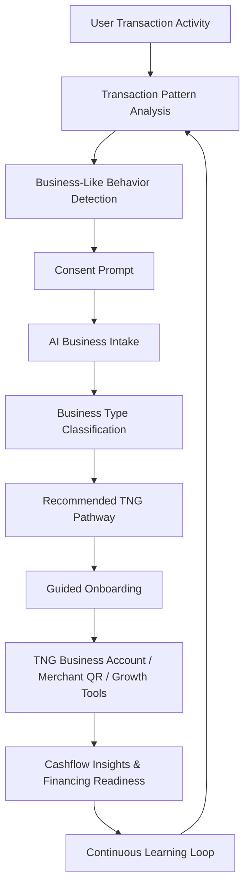
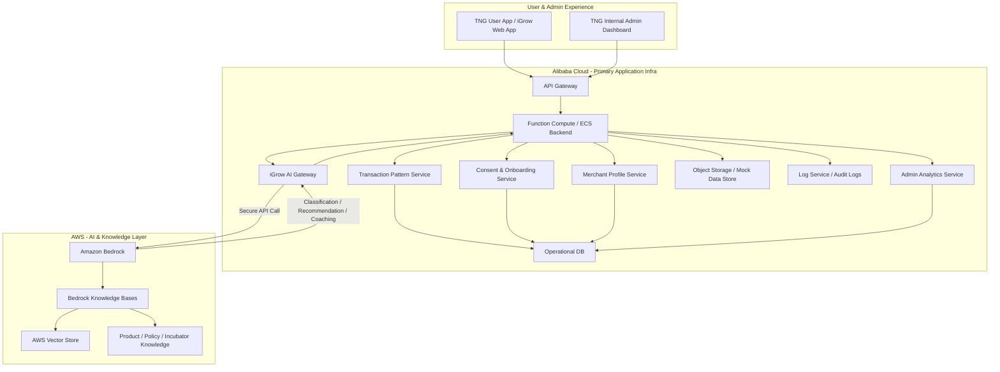
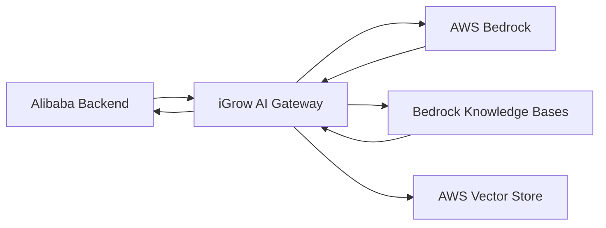
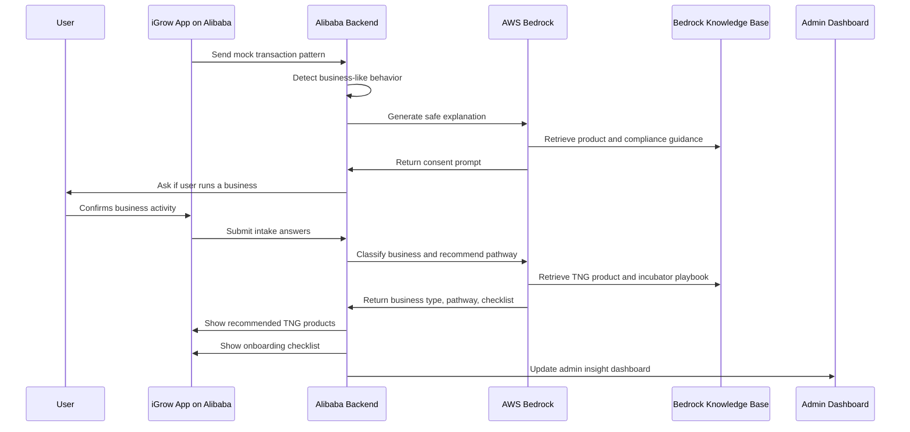

# iGrow — AI-Powered SME Financial Inclusion Platform

> **Dual-Cloud Hackathon Architecture: Alibaba Cloud + AWS**

---

## One-Liner Pitch

**iGrow helps everyday TNG users grow into finance-ready merchants** by analyzing transaction behavior, identifying business potential, and guiding them into the right TNG business products — with user consent.

---

## Table of Contents

1. [Core Concept](#1-core-concept)
2. [Problem Statement](#2-problem-statement)
3. [Why This Matters for Financial Inclusion](#3-why-this-matters-for-financial-inclusion)
4. [What Makes iGrow Different](#4-what-makes-igrow-different)
5. [High-Level Product Flow](#5-high-level-product-flow)
6. [Dual-Cloud Architecture](#6-dual-cloud-architecture)
7. [Key Product Modules](#7-key-product-modules)
8. [Example User Journey — Kak Siti](#8-example-user-journey--kak-siti)
9. [Admin Dashboard](#9-admin-dashboard)
10. [MVP Scope for Hackathon](#10-mvp-scope-for-hackathon)
11. [Tech Stack](#11-tech-stack)
12. [Data Models](#12-data-models)
13. [Compliance & Trust Guardrails](#13-compliance--trust-guardrails)
14. [Success Metrics](#14-success-metrics)
15. [Risks & Mitigations](#15-risks--mitigations)
16. [Recommended Build Plan](#16-recommended-build-plan)

---

## 1. Core Concept

iGrow is an **AI-driven financial inclusion platform** that identifies users with business-like transaction behavior and guides them — with consent — into the right TNG merchant and financial services journey.

Instead of waiting for micro-SMEs to manually discover business products, iGrow helps TNG **proactively identify, educate, and onboard** potential merchants into:

- TNG Business Account
- Merchant QR
- Business tracking tools
- Campaign / voucher tools
- BizCash readiness pathway
- Future financing support
- Micro-incubator growth opportunities

> **The core idea:** TNG becomes a micro-incubator for underserved businesses, helping informal users become visible, properly onboarded, and finance-ready.

---

## 2. Problem Statement

Many micro-SMEs, home sellers, freelancers, pasar malam traders, gig workers, and informal merchants already use TNG-like payment channels for business activity — but they may not know:

- They should separate personal and business funds
- They are eligible for a business account
- They can accept QR payments properly
- They can track sales and cashflow
- They can prepare for financing
- Which TNG product fits their business stage

As a result, many small businesses remain:

> **Financially active, but financially invisible.**

---

## 3. Why This Matters for Financial Inclusion

Financial inclusion is not just about giving users access to financial products. It is about helping underserved users become:

- ✅ Digitally visible
- ✅ Financially understood
- ✅ Properly onboarded
- ✅ Business-ready
- ✅ Financing-ready
- ✅ Less dependent on informal borrowing

### Relevant User Segments

| User Segment | Example |
|---|---|
| Home-based sellers | Home baker, nasi lemak seller, kuih seller |
| Informal merchants | Pasar malam trader, roadside stall |
| Freelancers | Tutor, designer, repair service |
| Social sellers | Instagram, TikTok, WhatsApp seller |
| Gig workers | Drivers, delivery riders, part-time sellers |
| Micro-SMEs | Small shop, kiosk, food stall |

---

## 4. What Makes iGrow Different

This is **not** just an AI chatbot for onboarding.

The real value is: **AI-powered user-to-merchant conversion and financial growth pathway.**

iGrow helps TNG convert users who already show business behavior into properly onboarded, engaged, and finance-ready merchants.



---

## 5. High-Level Product Flow



---

## 6. Dual-Cloud Architecture

### Cloud Split

| Layer | Cloud | Purpose |
|---|---|---|
| User app | Alibaba Cloud | Main user-facing experience |
| Admin dashboard | Alibaba Cloud | TNG internal dashboard |
| Backend APIs | Alibaba Cloud | Core application services |
| Transaction pattern detection | Alibaba Cloud | Rule-based transaction analysis |
| User / merchant database | Alibaba Cloud | Operational records |
| Consent and audit logs | Alibaba Cloud | Compliance and traceability |
| AI reasoning | AWS Bedrock | Classification, recommendations, coaching |
| RAG / knowledge retrieval | AWS Bedrock Knowledge Bases | Grounded product and policy responses |
| Vector store | AWS | Product docs, incubator playbooks, compliance-safe language |
| AI Gateway | Alibaba → AWS | Seamless cross-cloud bridge |

### Architecture Diagram



### Why The Dual-Cloud Design Makes Sense

**Alibaba Cloud** is the main fintech application platform. It handles:
- User app & admin dashboard
- Backend APIs & transaction scoring
- Mock transaction data & user/merchant profiles
- Consent records, audit logs, operational analytics

**AWS** is the AI intelligence and knowledge layer. It handles:
- Business classification & product recommendation
- Onboarding checklist generation & cashflow coaching
- Financing readiness explanation
- RAG over product docs and compliance rules
- Incubator opportunity recommendation

### iGrow AI Gateway

To avoid the frontend directly calling AWS, an internal gateway bridges the clouds:



**Gateway responsibilities:**
- Call AWS Bedrock & retrieve product knowledge
- Apply prompt templates & validate JSON output
- Apply safety guardrails & log AI outputs
- Return clean response to Alibaba backend

**Internal API endpoints:**
```
POST /api/ai/classify-business
POST /api/ai/recommend-pathway
POST /api/ai/generate-checklist
POST /api/ai/generate-insight
POST /api/ai/explain-readiness
```

---

## 7. Key Product Modules

### Module 1: Business-Like Transaction Detection
> **Cloud: Alibaba Cloud**

Monitors transaction behavior and identifies users who may be operating a small business.

| Signal | Example |
|---|---|
| High number of small inflows | 30 payments of RM5–RM20 daily |
| Regular transaction timing | Peak during lunch / dinner hours |
| Repeat payer patterns | Same customers paying weekly |
| Consistent weekly income | Stable inflows over several weeks |
| Business-like descriptions | "nasi lemak", "cake order", "tuition fee" |
| Increasing payment volume | Growing customer base |

**Example Output:**
```json
{
  "user_id": "U001",
  "business_likelihood_score": 82,
  "detected_signals": [
    "High number of small inflows",
    "Morning transaction peak",
    "Repeat payer pattern",
    "Food-related descriptions"
  ],
  "should_prompt": true
}
```

---

### Module 2: Consent-Based Smart Onboarding
> **Cloud: Alibaba Cloud + AWS Bedrock**

The system asks clearly and softly — never automatic onboarding:

> *Looks like you may be receiving regular payments for a small business. Would you like to explore a TNG Business Account to separate your business income, track sales, and unlock merchant tools?*

| User Choice | System Behavior |
|---|---|
| Yes, I run a business | Start AI business intake |
| Tell me more | Explain benefits |
| Not now | Do not proceed |
| This is personal use | Store opt-out / reduce future prompts |

> **Note:** Avoid promising guaranteed revenue growth. Better: *"Based on similar merchant journeys, tools such as QR payments, sales tracking, and campaigns may help you manage and grow your business better. This is not financial advice."*

---

### Module 3: AI Business Intake
> **Cloud: AWS Bedrock**

After consent, the AI asks simple questions:
1. What do you sell or provide?
2. Do you sell online, offline, or both?
3. Do you have SSM registration?
4. Do you receive payments daily or occasionally?
5. Do you need QR payment, cashflow tracking, or financing later?

---

### Module 4: Business Type Classification
> **Cloud: AWS Bedrock**

| User Type | Recommended Pathway |
|---|---|
| Home food seller | Business Account + QR + basic sales tracking |
| Pasar malam trader | Merchant QR + daily sales dashboard |
| Freelancer | Business Account + invoice/payment tracking |
| Social seller | QR payment + campaign tools |
| Small shop | Business Account + outlet profile + Near Me |
| Growing SME | Business Account + BizCash readiness |

**Example Output:**
```json
{
  "business_type": "Home-Based Food Seller",
  "business_stage": "Early Active",
  "confidence": 0.91,
  "recommended_pathway": [
    "TNG Business Account",
    "Merchant QR",
    "Weekly Sales Summary",
    "Breakfast Campaign Template",
    "BizCash Readiness Later"
  ]
}
```

---

### Module 5: Product Recommendation Engine
> **Cloud: AWS Bedrock + Bedrock Knowledge Bases**

| User Need | Suggested TNG Service |
|---|---|
| Separate business and personal funds | Business Account |
| Accept customer payments | Merchant QR |
| Track sales | Merchant Dashboard |
| Increase visibility | Near Me |
| Run promos | Voucher / cashback tools |
| Access working capital later | BizCash readiness |
| Understand performance | Cashflow tracking |

---

### Module 6: Micro-Incubator Opportunity Engine
> **Cloud: AWS Bedrock + RAG**

| Business Type | Micro-Incubator Opportunity |
|---|---|
| Home food seller | Breakfast promo template |
| Social seller | QR payment link for WhatsApp orders |
| Pasar malam trader | Offline QR poster + daily sales summary |
| Freelancer | Invoice/payment tracking |
| Small shop | Near Me visibility |
| Growing SME | BizCash readiness checklist |
| New merchant | "First 10 QR payments" activation challenge |

**Example Growth Path:**
```
1. Set up TNG Business Account
2. Generate Merchant QR
3. Complete your first 10 merchant transactions
4. Try a breakfast bundle campaign
5. Build 3 months of clean sales history for BizCash readiness
```

---

### Module 7: Personalized Onboarding Checklist
> **Cloud: AWS Bedrock + Alibaba DB**

| Task | Status |
|---|---|
| Confirm business name | Pending |
| Select business category | Recommended: Food & Beverage |
| Set up TNG Business Account | Ready |
| Generate QR code | Ready |
| Add business location / delivery area | Optional |
| Track first 10 business payments | Next step |
| Prepare SSM for future financing | Recommended later |

---

### Module 8: Financing Readiness Profile
> **Cloud: Alibaba scoring + AWS explanation**

This is **not a credit score** — it is a readiness profile that helps users understand what they need before applying for financing.

**Tracks:**
- Consistency of income & sales growth
- Transaction stability & cashflow volatility
- Repayment capacity estimate
- Missing requirements (SSM, business/personal fund separation)

**Example Output:**
```json
{
  "readiness_level": "Building",
  "readiness_score": 46,
  "safe_explanation": "You are building a stronger business profile, but your sales history is still short.",
  "next_steps": [
    "Use your Business Account for business income only",
    "Continue accepting QR payments",
    "Build at least 3 months of transaction history",
    "Prepare SSM if you plan to explore financing later"
  ]
}
```

---

### Module 9: AI Cashflow & Growth Coach
> **Cloud: AWS Bedrock**

Provides plain-language insights based on merchant activity:

> *Your sales are strongest between 7am–10am. Consider running a breakfast bundle promo during this period.*

> *Your weekly income dropped 18% compared to last week. Check if stock availability or customer traffic changed.*

> *Your business income and personal spending are mixed. Consider using your Business Account for business income only so your records are cleaner.*

---

## 8. Example User Journey — Kak Siti

**Persona:** Kak Siti, Home-Based Nasi Lemak Seller

### Current Situation
Kak Siti sells nasi lemak from home, receiving many small TNG payments (RM5–RM12) every morning between 7am and 10am via her personal TNG account — because she doesn't know she can set up a business pathway.

### Detection

| Signal | Interpretation |
|---|---|
| Many small inflows | Customer payments |
| Morning transaction peak | Breakfast business |
| Repeat payers | Regular customers |
| Food-related descriptions | Nasi lemak sales |
| Consistent weekday pattern | Active micro-business |

### Consent Prompt
> *Looks like you may be receiving payments for a small business. Would you like to separate your business income and unlock merchant tools?*

Kak Siti taps: **Yes, I run a business.**

### AI Classification
iGrow asks: *"What do you sell?"*
Kak Siti: *"I sell nasi lemak from home."*
iGrow classifies her as: **Home-Based Food Seller**

### Recommended Path

| Step | Recommendation |
|---|---|
| Account | TNG Business Account |
| Payment tool | Merchant QR |
| Tracking | Weekly sales summary |
| Growth | Breakfast promo suggestion |
| Financing | Build 3 months of sales history before BizCash readiness |

### Post-Onboarding Insights

**After 2 weeks:**
> *Your average weekday sales are RM145. Sales peak between 7am and 9am. You may want to prepare 15% more stock on Mondays and Fridays.*

**After 3 months:**
> *Your sales history is now more consistent. You may be ready to explore small working capital financing preparation.*

---

## 9. Admin Dashboard

For TNG internal teams, iGrow provides an admin dashboard.

| Dashboard Area | What It Shows |
|---|---|
| Potential SME users | Users with business-like transaction patterns |
| Consent conversion | How many users accepted onboarding prompt |
| Business categories | Food, retail, services, freelancers |
| Activation status | QR generated, first transaction, active merchant |
| Product adoption | Business Account, campaigns, BizCash readiness |
| Micro-incubator opportunities | Recommended growth paths |
| Risk flags | Suspicious patterns or inconsistent activity |
| Financial inclusion impact | Informal users converted to merchants |
| Cross-cloud AI activity | AI classifications and recommendations generated |

### Example Dashboard Metrics

| Metric | Value |
|---|---|
| Potential SME users detected | 1,248 |
| Consent accepted | 38% |
| Business Account started | 421 |
| Merchant QR generated | 318 |
| First QR payment completed | 206 |
| BizCash readiness building | 89 |
| Top segment | Home-based food sellers |

---

## 10. MVP Scope for Hackathon

| Feature | Cloud Used | Demo Version |
|---|---|---|
| Transaction pattern analysis | Alibaba Cloud | Mock TNG transaction data |
| Business-like behavior detection | Alibaba Cloud | Show detected SME pattern |
| Consent prompt | Alibaba + AWS | User chooses to proceed |
| AI business classification | AWS Bedrock | Classify user as home seller / freelancer / stall |
| Product pathway recommendation | AWS Bedrock + Knowledge Base | Recommend TNG Business Account, QR, growth tools |
| Onboarding checklist | AWS Bedrock | Generate personalized next steps |
| Financing readiness preview | Alibaba + AWS | Show future BizCash preparation |
| Micro-incubator opportunity | AWS Bedrock | Recommend campaign / growth playbook |
| Dashboard | Alibaba Cloud | Show user + admin view |

### MVP Demo Flow



---

## 11. Tech Stack

### Alibaba Cloud

| Need | Recommended Service |
|---|---|
| Frontend hosting | ECS / Function Compute / static web hosting |
| API layer | API Gateway |
| Backend services | Function Compute or ECS |
| Main database | ApsaraDB RDS / PolarDB |
| Object storage | OSS |
| Logs and audit | Log Service / SLS |
| Admin metrics | DB-driven dashboard / Quick BI optional |

### AWS

| Need | Recommended Service |
|---|---|
| LLM reasoning | Amazon Bedrock |
| RAG | Bedrock Knowledge Bases |
| Vector store | OpenSearch Serverless / Aurora vector store |
| Knowledge files | S3 |
| Optional workflow | Step Functions |
| Optional AWS-side API | Lambda + API Gateway |

### Fastest Hackathon Stack

```
Frontend:   Next.js + Tailwind + shadcn/ui
Infra:      Alibaba Cloud hosting + backend API
AI Layer:   AWS Bedrock
RAG:        Bedrock Knowledge Bases + AWS vector store
Data:       Mock JSON / CSV transaction data
```

### Bedrock Knowledge Base — Suggested Documents

```
/tng-products/business-account.md
/tng-products/merchant-qr.md
/tng-products/merchant-dashboard.md
/tng-products/campaign-tools.md
/tng-products/bizcash-readiness.md
/compliance/safe-financial-language.md
/incubator/home-food-seller-playbook.md
/incubator/freelancer-playbook.md
/incubator/social-seller-playbook.md
/incubator/pasar-malam-trader-playbook.md
```

---

## 12. Data Models

### User
```json
{
  "user_id": "U001",
  "name": "Kak Siti",
  "account_type": "personal",
  "consent_status": "accepted",
  "business_profile_id": "B001"
}
```

### Transaction
```json
{
  "transaction_id": "T001",
  "user_id": "U001",
  "amount": 7.00,
  "direction": "inflow",
  "timestamp": "2026-04-20T07:45:00",
  "description": "nasi lemak",
  "payer_id": "P102"
}
```

### Business Profile
```json
{
  "business_profile_id": "B001",
  "user_id": "U001",
  "business_name": "Kak Siti Nasi Lemak",
  "business_type": "Home-Based Food Seller",
  "business_stage": "Early Active",
  "has_ssm": false,
  "recommended_products": [
    "TNG Business Account",
    "Merchant QR",
    "Weekly Sales Summary",
    "Breakfast Campaign Template"
  ]
}
```

### Financing Readiness
```json
{
  "user_id": "U001",
  "readiness_level": "Building",
  "sales_history_days": 21,
  "income_consistency": "Moderate",
  "cashflow_volatility": "Medium",
  "fund_separation": "Poor",
  "next_steps": [
    "Use Business Account for all business income",
    "Build 3 months transaction history",
    "Prepare SSM registration"
  ]
}
```

---

## 13. Compliance & Trust Guardrails

| Guardrail | Why It Matters |
|---|---|
| Consent before onboarding | Avoids privacy concerns |
| Explainable recommendations | User understands why they are being prompted |
| No automatic loan approval | Reduces regulatory risk |
| Human / rules-based review where needed | Keeps compliance control |
| Clear opt-out | User can reject business pathway |
| Data minimization | Use only necessary transaction signals |
| Fairness checks | Avoid excluding users unfairly |
| Responsible borrowing warnings | Prevents over-borrowing |

### Language Guidelines

| ❌ Avoid Saying | ✅ Better Saying |
|---|---|
| AI automatically decides who gets financial products | AI identifies potential fit and recommends the right pathway with user consent |
| AI gives a credit score | AI creates a financing readiness profile |
| AI approves loans | AI helps users prepare for financing and supports existing approval processes |
| You can earn 30% more | Similar merchant tools may help you manage and grow your business better |
| You qualify for BizCash | You may be ready to explore BizCash preparation |

---

## 14. Success Metrics

| Metric | Meaning |
|---|---|
| Prompt acceptance rate | Whether users find the recommendation relevant |
| Business Account conversion | Whether users onboard successfully |
| QR activation rate | Whether users start using merchant tools |
| First 30-day transaction activity | Whether onboarding leads to real usage |
| BizCash readiness progression | Whether users become financing-ready |
| Campaign tool adoption | Whether users use growth tools |
| Reduction in fund mixing | Whether business/personal money separation improves |
| User retention | Whether merchants stay active |
| Cross-cloud AI calls completed | Whether dual-cloud architecture is functioning |
| AI recommendation acceptance | Whether AI suggestions are useful |

---

## 15. Risks & Mitigations

| Risk | Mitigation |
|---|---|
| Users feel watched | Use soft prompt, clear explanation, opt-out |
| AI misclassifies personal activity as business | Ask for confirmation before proceeding |
| Regulatory concern around credit scoring | Position as readiness, not approval |
| Bad financial advice | Use safe ranges, disclaimers, rules-based limits |
| Bias against informal merchants | Use inclusive design and human review |
| Low adoption | Make benefit clear: cleaner income, QR, growth tools |
| Duplicate with existing onboarding | Focus on discovery, routing, activation, and growth |
| Dual-cloud feels forced | Use Alibaba as app layer and AWS as AI intelligence layer |
| AI hallucination | Use Bedrock Knowledge Base and compliance-safe templates |

---

## 16. Recommended Build Plan

### Day 1 — Core Product Demo
- [ ] Create mock transaction profiles
- [ ] Build rule-based detection engine
- [ ] Build user app screens
- [ ] Build consent prompt
- [ ] Build admin dashboard skeleton

### Day 2 — AI + Dual Cloud
- [ ] Connect Alibaba backend to AWS Bedrock
- [ ] Add business classification
- [ ] Add product recommendation
- [ ] Add checklist generation
- [ ] Add Bedrock Knowledge Base content

### Day 3 — Polish + Pitch
- [ ] Add Kak Siti journey
- [ ] Add cashflow insights
- [ ] Add financing readiness preview
- [ ] Add cross-cloud architecture slide
- [ ] Polish UI and dashboard
- [ ] Prepare final pitch narrative

---

## Final Pitch

> **iGrow is an AI-powered SME pathway engine for TNG** that identifies users with business-like transaction behavior and guides them, with consent, into the right merchant journey — from TNG Business Account onboarding and QR activation to cashflow insights, micro-incubator opportunities, and financing readiness.
>
> The platform uses **Alibaba Cloud** as the main fintech infrastructure layer and **AWS Bedrock** as the AI intelligence layer, creating a seamless dual-cloud system for financial inclusion.

**Short version:**
> iGrow turns informal TNG business activity into a structured merchant journey. It detects users who may be operating micro-businesses, asks for consent, recommends the right TNG Business Account and merchant tools, then helps them grow toward financing readiness.

---

*iGrow is not just an AI onboarding chatbot. It is a dual-cloud financial inclusion platform that helps TNG discover, onboard, activate, and grow financially invisible micro-SMEs.*
